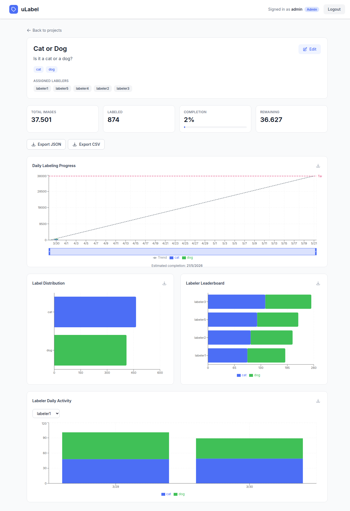
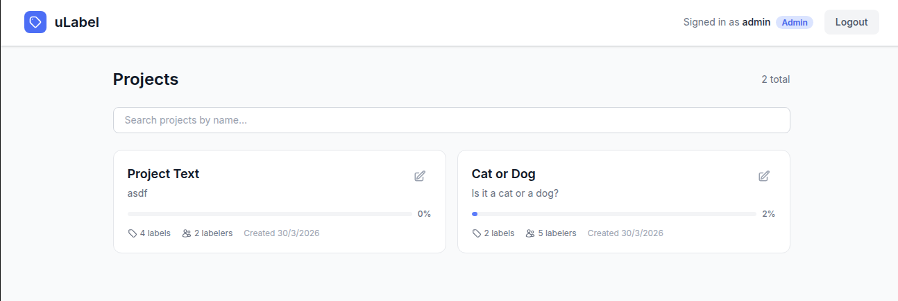
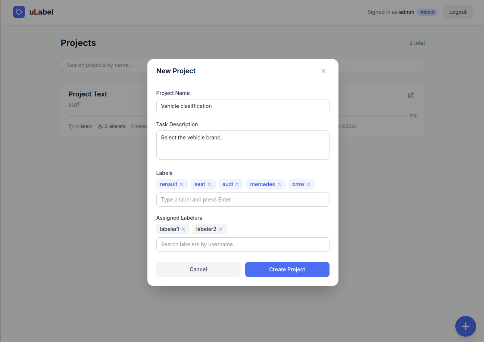
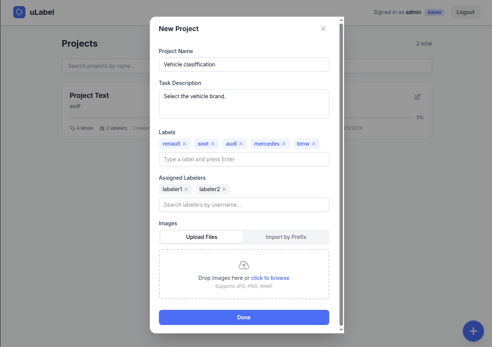
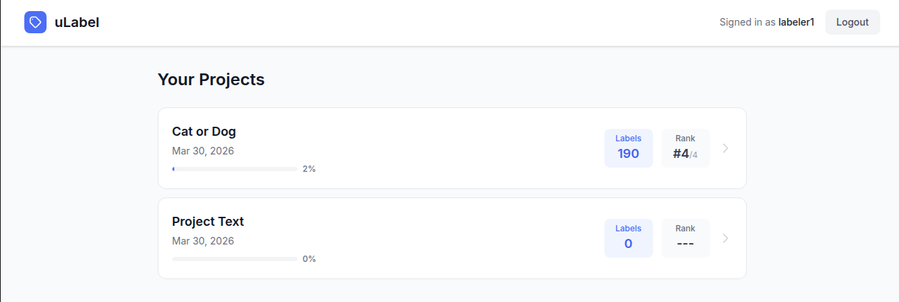
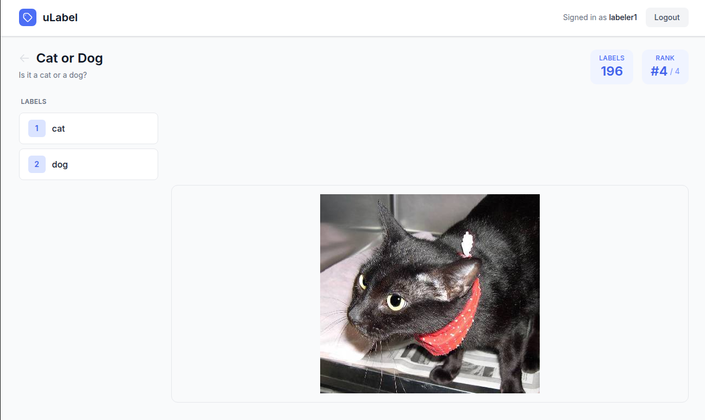

# uLabel

An image labeling platform for managing annotation projects, assigning tasks to labelers, and tracking progress with real-time dashboards.

Built with FastAPI, React, PostgreSQL, MinIO, and a full observability stack (Prometheus, Grafana, Tempo, Loki).



## Quick Start

### Prerequisites

- [Docker](https://docs.docker.com/get-docker/) and [Docker Compose](https://docs.docker.com/compose/install/) (v2+)
- [Make](https://www.gnu.org/software/make/)

### Start the platform

```bash
git clone git@github.com:pablo-campillo/ulabel.git
cd ulabel
make bootstrap
```

This single command builds and starts all services, runs database migrations, creates default users, and downloads the [Dogs vs. Cats](https://www.microsoft.com/en-us/download/details.aspx?id=54765) dataset (~800 MB) into MinIO.

> The first run takes a few minutes due to Docker image builds and dataset download.

Once ready, the terminal shows all access URLs:

| Service         | URL                          | Credentials            |
|-----------------|------------------------------|------------------------|
| Frontend        | http://localhost:5173        | See users below        |
| Backend API     | http://localhost:8000        | -                      |
| API Docs        | http://localhost:8000/redoc  | -                      |
| Documentation   | http://localhost:8080        | -                      |
| Grafana         | http://localhost:3000        | `admin` / `admin`      |
| MinIO Console   | http://localhost:9001        | `minioadmin` / `minioadmin` |

**Seeded users** (no password):

| Username   | Role    |
|------------|---------|
| `admin`    | Admin   |
| `labeler1` ... `labeler10` | Labeler |

## User Guide

### Admin

Log in as `admin` at http://localhost:5173.

**Projects list** — view all projects with progress and stats.



**Create a project** — click **+** to define a project with name, description, labels, and assigned labelers. Upload images or import from MinIO by prefix.

<p align="center">
  
  
</p>

**Project dashboard** — track progress with daily charts, label distribution, labeler leaderboard, and individual activity. Export labels as JSON or CSV.

### Labeler

Log in as `labeler1` to see assigned projects with your label count and ranking.



Select a project to start labeling. Click a label or use keyboard shortcuts (`1`, `2`, ...) to classify images.



### Grafana Dashboards

Open http://localhost:3000 (`admin` / `admin`). Pre-configured dashboards:

- **uLabel Overview** — platform-wide metrics
- **uLabel Labeling Activity** — labeling throughput and patterns
- **uLabel Traces & Logs** — request traces and application logs

## Stop the platform

```bash
make down       # Stop services (keep data)
make down-v     # Stop and delete all data
```
