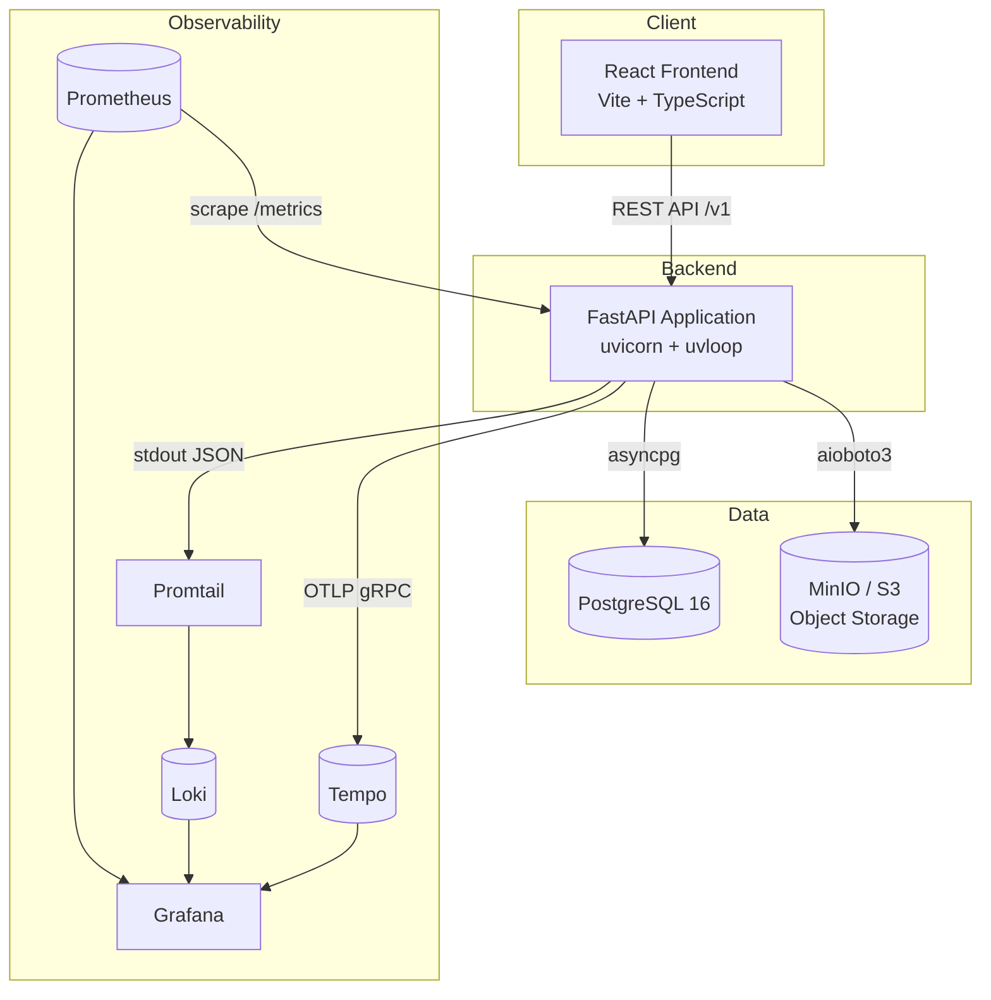
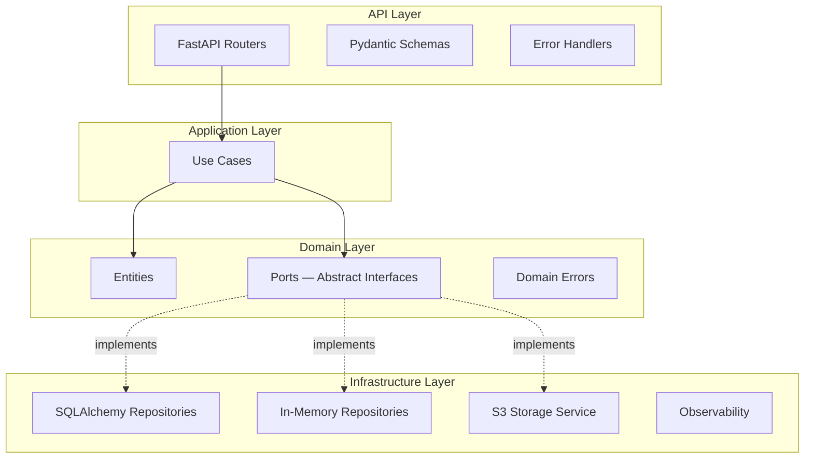
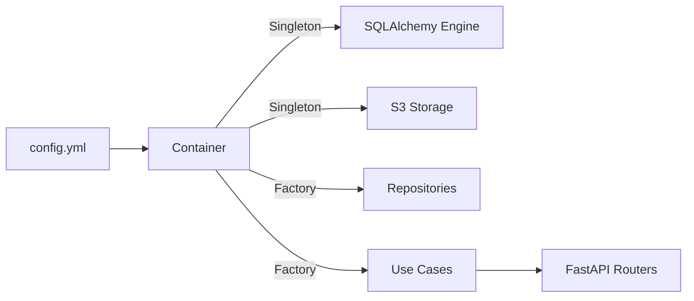

# Architecture

uLabel is an image labeling platform composed of multiple services working together. This page explains the overall platform design and the internal architecture of the backend.

## Platform Overview

| Component | Technology | Purpose |
|-----------|-----------|---------|
| Frontend | React 18 + Vite + TypeScript | Labeling UI, admin dashboard, statistics |
| Backend | FastAPI + Python 3.12 | REST API, business logic, background tasks |
| Database | PostgreSQL 16 (asyncpg) | Persistent storage for projects, images, labels, users |
| Object Storage | MinIO (S3-compatible) | Image file storage with presigned URL access |
| Observability | Prometheus, Tempo, Loki, Grafana | Metrics, traces, logs, dashboards |

The frontend communicates with the backend exclusively through the REST API under the `/v1` prefix. The backend owns all state: relational data lives in PostgreSQL and binary objects (images, exports) live in MinIO.

## Hexagonal Architecture (Ports & Adapters)

The backend follows **Hexagonal Architecture** to keep business logic independent of frameworks and infrastructure.

### Domain Layer

The innermost layer contains:

- **Entities**: Core business objects (`Project`, `Image`, `LabelRecord`, `User`) as plain Python dataclasses with factory methods and state transitions.
- **Ports**: Abstract base classes (`ProjectRepository`, `ImageRepository`, `LabelRepository`, `UserRepository`, `StatsRepository`, `StorageService`) that define the contracts the domain needs from the outside world.
- **Errors**: Domain-specific exceptions (`ProjectNotFound`, `ImageNotInProgress`, `LabelerMismatch`, etc.) that the API layer maps to HTTP responses.

The domain has **zero external dependencies** — it defines contracts that other layers implement.

### Application Layer

Contains **use cases** that orchestrate business workflows:

- Each use case is a single class in its own file with an `execute()` method (e.g., `CreateAssignmentUseCase`, `SubmitLabelUseCase`).
- Use cases depend only on domain ports, injected via constructor.
- They enforce business rules and coordinate between multiple repositories.
- No logging or infrastructure concerns — the application layer stays pure.

### API Layer

The outermost entry point:

- **Routers**: FastAPI route handlers that translate HTTP into use case calls.
- **Schemas**: Pydantic v2 models for request validation and response serialization.
- **Error Handlers**: A global handler that maps every `DomainError` subclass to its HTTP status code and structured JSON body.
- **Business event logging** lives here, not in use cases — see [Observability Design](observability.md#architectural-decision-where-to-log).

### Infrastructure Layer

Implements the domain ports:

- **SQLAlchemy Repositories**: Production database access using async SQLAlchemy 2.0, one repository per aggregate.
- **In-Memory Repositories**: Test doubles for unit testing without a database, using simple dictionaries.
- **S3 Storage Service**: Image storage and presigned URL generation via aioboto3, compatible with AWS S3 and MinIO.
- **Observability**: OpenTelemetry tracing, Prometheus metrics middleware, structured JSON logging.

## Dependency Injection

uLabel uses [dependency-injector](https://python-dependency-injector.ets-labs.org/) with a `DeclarativeContainer` to wire everything together. The `Container` class in `container.py` defines:

- **Singletons** for expensive resources: database engine, session factory, storage service.
- **Factories** for per-request resources: repositories and use cases.
- **Configuration** loaded from `config.yml` with environment variable interpolation.

The container is wired to FastAPI router modules at startup, allowing route handlers to declare dependencies with `Depends(Provide[Container.xxx])` and the `@inject` decorator.

This means:

- **Production** uses real PostgreSQL repositories and S3 storage.
- **Unit tests** swap in in-memory repositories and fake storage with no container changes needed — just construct use cases with test doubles directly.
- **Integration tests** use the real container pointed at a test database.

## Key Design Decisions

| Decision | Rationale |
|---|---|
| Hexagonal Architecture | Testability and framework independence — business logic has zero dependency on FastAPI, SQLAlchemy, or S3 |
| Async throughout | All I/O (database, storage, HTTP) is async for high throughput under concurrent labeling workloads |
| One use case per file | Clear responsibility boundaries and easy navigation |
| Domain ports as ABCs | Explicit contracts make it obvious what each layer expects |
| In-memory test doubles | Fast unit tests (milliseconds) without infrastructure |
| Logging only in API layer | Domain and application layers stay pure — see [Observability Design](observability.md) |
| Dependency-injector | Declarative wiring with lifecycle management (singleton/factory), avoids manual DI boilerplate |
| `config.yml` with env interpolation | Readable defaults with environment-specific overrides, no scattered `os.getenv()` calls |
