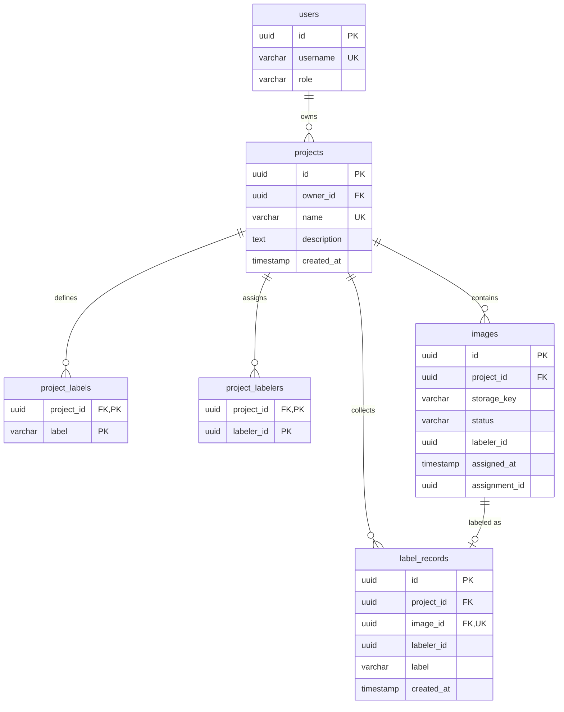

# Database Design

uLabel uses PostgreSQL as its primary data store, accessed asynchronously through SQLAlchemy 2.0 and asyncpg. This page explains the schema design and the reasoning behind key database decisions.

## Entity-Relationship Diagram



## Tables

### `users`

Stores both admin and labeler accounts. The `role` field (`admin` or `labeler`) determines access level. Usernames are unique and used for login.

### `projects`

A labeling project groups images under a set of allowed labels and assigned labelers. The `owner_id` foreign key points to the admin who created it. Project names are unique (enforced by migration 0003).

### `project_labels` and `project_labelers`

Junction tables implementing the many-to-many relationships. Both use cascade delete — removing a project removes all its label definitions and labeler assignments. These are fully replaced on project save (delete all + re-insert) to keep the logic simple and avoid complex diffing.

### `images`

The central workflow table. Each image belongs to a project and moves through statuses: `pending` → `in_progress` → `done`. Key fields:

- `storage_key` + `project_id` form a unique constraint, preventing duplicate imports.
- `status` is indexed for efficient filtering during assignment queries.
- `labeler_id`, `assigned_at`, and `assignment_id` are populated when an image is assigned and cleared when expired.

### `label_records`

Stores submitted labels. The unique constraint on `image_id` enforces **one label per image** — once labeled, an image cannot be relabeled. The `created_at` timestamp uses a server-side default (`func.now()`) for consistent time tracking.

## Design Decisions

### PostgreSQL + asyncpg

PostgreSQL was chosen for its robustness, JSON support, and advanced locking features (`SELECT ... FOR UPDATE SKIP LOCKED`). The `asyncpg` driver provides native async support without connection pool overhead, integrating naturally with FastAPI's async request handling.

### SQLAlchemy 2.0 Async

SQLAlchemy 2.0 with `mapped_column` provides:

- Full type safety with `Mapped[T]` annotations.
- Native async session support via `AsyncSession` and `async_sessionmaker`.
- Compatibility with Alembic for migrations.

Each repository creates its own session via the shared `async_sessionmaker`, keeping transactions scoped to individual operations.

### ORM-Domain Mapping

ORM models are **not** used as domain entities. Instead, each model has `to_domain()` and `from_domain()` class methods that convert between the SQLAlchemy model and the plain dataclass domain entity. This keeps the domain layer free of SQLAlchemy dependencies and allows the ORM to evolve independently.

```python
# Infrastructure model → Domain entity
image = image_model.to_domain()

# Domain entity → Infrastructure model
model = ImageModel.from_domain(image)
```

### Upsert Semantics

All save operations use PostgreSQL's `INSERT ... ON CONFLICT` instead of separate insert/update paths:

- **`on_conflict_do_update`**: Used for images and users — updates mutable fields if the row already exists.
- **`on_conflict_do_nothing`**: Used for bulk imports and label submission — silently skips duplicates.

This makes operations idempotent and avoids race conditions in concurrent scenarios.

### Row-Level Locking for Assignment

The image assignment query uses `SELECT ... FOR UPDATE SKIP LOCKED`:

```sql
SELECT * FROM images
WHERE project_id = :id AND status = 'pending'
ORDER BY id
LIMIT 1
FOR UPDATE SKIP LOCKED
```

- `FOR UPDATE` locks the selected row, preventing two labelers from being assigned the same image.
- `SKIP LOCKED` skips already-locked rows instead of waiting, so concurrent requests get different images instantly.
- `ORDER BY id` uses the UUID primary key, which provides an implicit shuffle of the original ingestion order (see [Image Ingestion — Assignment and Implicit Shuffle](image-ingestion.md#assignment-and-implicit-shuffle)).

### Bulk Insert in Chunks

The bulk import operation inserts images in chunks of 1,000 rows:

```python
chunk_size = 1000
for i in range(0, len(images), chunk_size):
    chunk = images[i : i + chunk_size]
    await session.execute(
        insert(ImageModel).values([...]).on_conflict_do_nothing()
    )
await session.commit()
```

Chunking prevents memory spikes and keeps individual SQL statements within PostgreSQL's parameter limit. `on_conflict_do_nothing` makes re-imports safe — running the same import twice won't create duplicates.

### Eager Loading Strategy

Project queries use strategic eager loading to avoid N+1 problems:

| Relationship | Strategy | Why |
|---|---|---|
| `project.owner` | `joinedload` | Single related row — efficient as a JOIN |
| `project.label_entries` | `selectinload` | Collection — a separate `SELECT ... IN (...)` avoids row multiplication |
| `project.labeler_entries` | `selectinload` | Same reasoning as labels |

After joinedload, `.unique()` is called on the result set to deduplicate rows that were multiplied by the JOIN.

### Connection Pool Configuration

The engine is configured with:

- `pool_size` and `max_overflow` for connection limits.
- `pool_recycle` to rotate connections before PostgreSQL's timeout.
- `pool_pre_ping` to detect and discard stale connections before use.

All configurable via `config.yml` under the `database` key.

### Migrations with Alembic

Schema changes are managed by Alembic with async support. The migration runner in `env.py` uses the same `asyncpg` driver as the application. Migrations are numbered sequentially (`0001_`, `0002_`, `0003_`) for clear ordering.
