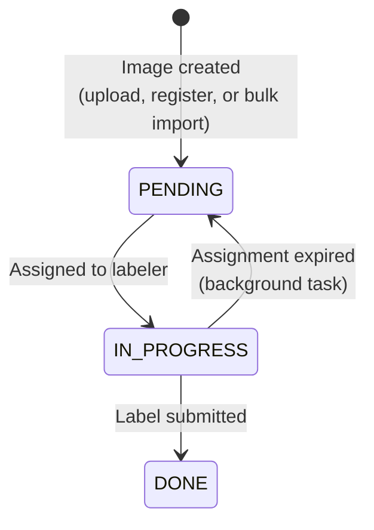
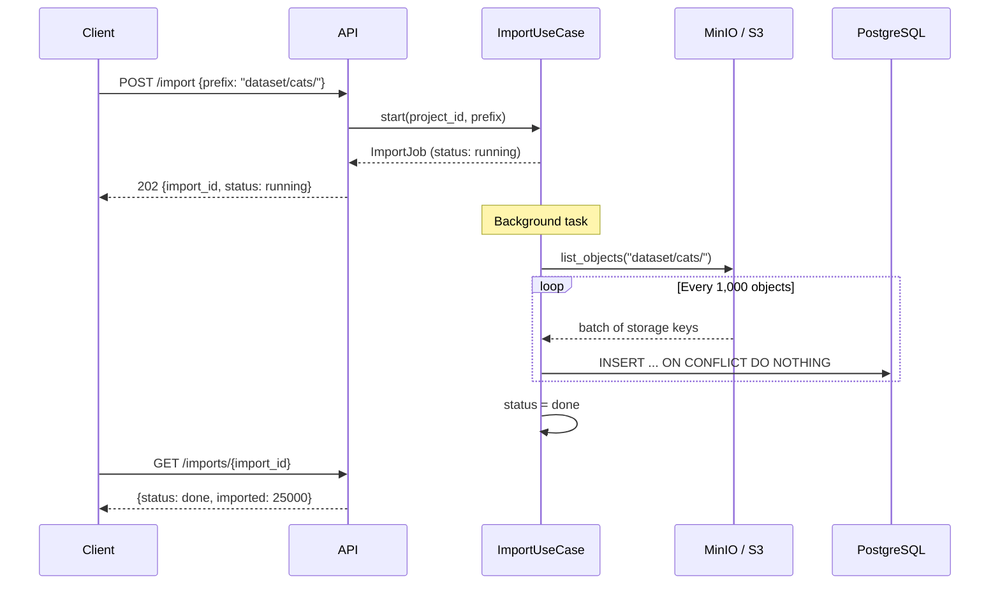
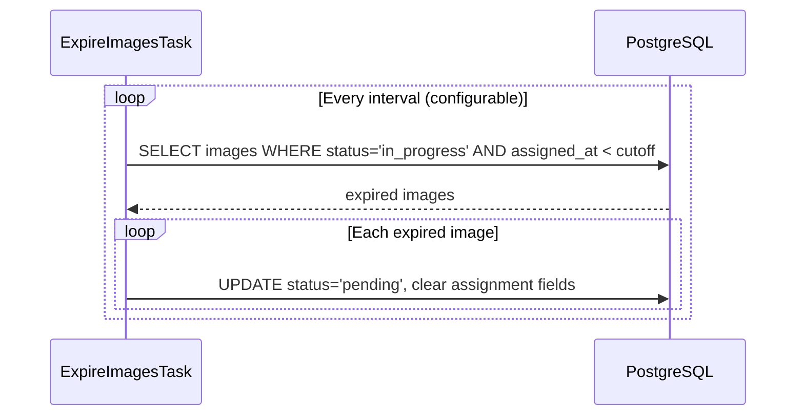

# Image Ingestion & Labeling Workflow

This page explains how images enter the system, how they are distributed to labelers, and the mechanisms that keep the workflow reliable under concurrent use.

## Image Lifecycle

Every image follows a three-state lifecycle:



| Status | Meaning |
|--------|---------|
| `PENDING` | Available for assignment — no labeler is working on it |
| `IN_PROGRESS` | Assigned to a labeler who has an active session with a presigned URL |
| `DONE` | Labeled — a `LabelRecord` exists for this image |

## Ingestion Methods

### Single Image Upload

`POST /v1/projects/{project_id}/images/upload` accepts a file upload. The backend:

1. Generates a UUID for the image.
2. Uploads the file to MinIO/S3 under the key `{project_id}/{image_id}`.
3. Creates an `Image` entity in `PENDING` status.

### Register Existing Storage Object

`POST /v1/projects/{project_id}/images` registers an image that already exists in object storage by its `storage_key`. Useful when images are uploaded through external pipelines.

### Bulk Import from Storage Prefix

`POST /v1/projects/{project_id}/images/import` is designed for large-scale ingestion — importing thousands or millions of images from a storage prefix.



Key design decisions:

- **Async job model**: The import starts immediately and returns a job ID. The client polls for completion. This avoids HTTP timeouts on large datasets.
- **Chunked inserts (1,000 rows)**: Each batch is inserted in a single `INSERT` statement, keeping memory usage bounded and staying within PostgreSQL's parameter limits.
- **`ON CONFLICT DO NOTHING`**: The unique constraint on `(project_id, storage_key)` prevents duplicates. Re-running an import is safe and idempotent.
- **In-memory job tracking**: Import jobs are stored in a module-level dictionary. This is sufficient for a single-instance deployment; a production multi-instance setup would use a persistent job store.

## Assignment and Implicit Shuffle

When a labeler requests an image, the system selects the next pending image:

```sql
SELECT * FROM images
WHERE project_id = :id AND status = 'pending'
ORDER BY id
LIMIT 1
FOR UPDATE SKIP LOCKED
```

The `ORDER BY id` clause orders by the image's UUID primary key. Since UUIDs (v4) are generated randomly, this ordering **implicitly shuffles** the images relative to their original ingestion order.

This is an important property: when a dataset is imported in bulk from a structured source (e.g., images organized by photographer, date, or category), the original order would cause labelers to see long runs of similar images. Ordering by random UUID breaks this pattern — labelers receive a mixed, varied stream of images, which:

- **Reduces labeler fatigue** from repetitive content.
- **Distributes edge cases** more evenly across labeling sessions.
- **Prevents bias** from labelers always seeing a particular subset first.

### Concurrent Assignment Safety

The `FOR UPDATE SKIP LOCKED` clause ensures safe concurrent assignment:

- **`FOR UPDATE`** locks the selected row, preventing two labelers from receiving the same image.
- **`SKIP LOCKED`** causes concurrent queries to skip already-locked rows rather than waiting, so multiple labelers can request images simultaneously without blocking each other.

This is a PostgreSQL-specific feature that provides optimistic concurrency without application-level locking or retry loops.

## Assignment Session

When an image is assigned:

1. The image transitions to `IN_PROGRESS` with the labeler's ID and a timestamp.
2. A unique `assignment_id` (UUID) is generated and stored on the image.
3. A **presigned URL** is generated for the image, valid for 30 minutes.

The `assignment_id` is returned to the client and must be included when submitting a label. This prevents stale sessions from submitting labels after an assignment has expired and been reassigned.

## Label Submission

When a labeler submits a label, the system validates:

1. The image exists and is `IN_PROGRESS`.
2. The `assignment_id` matches (guards against expired/reassigned sessions).
3. The `labeler_id` matches the assigned labeler.
4. The label value is in the project's allowed label set.

If all checks pass, the image moves to `DONE` and a `LabelRecord` is created. The unique constraint on `label_records.image_id` ensures each image is labeled exactly once.

The response includes the labeler's **ranking** within the project (position by label count among all labelers), providing real-time gamification feedback.

## Expiration of Abandoned Assignments

A background task (`ExpireImagesTask`) runs continuously and handles abandoned assignments:



- The **timeout** and **check interval** are configurable via `config.yml`.
- Expired images return to `PENDING` status, making them available for reassignment.
- This handles cases where a labeler closes their browser, loses connectivity, or simply doesn't complete the task.

## Presigned URLs

All image access goes through presigned URLs generated by the storage service:

- **Assignment URLs** (30-minute expiry): Allow labelers to view the image in the browser without direct storage credentials.
- **Export URLs** (1-hour expiry): Allow downloading exported label files (JSON/CSV).

The backend generates URLs using aioboto3's `generate_presigned_url`, supporting both MinIO (development) and AWS S3 (production) with the same code path.
