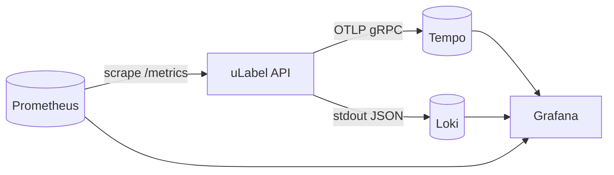
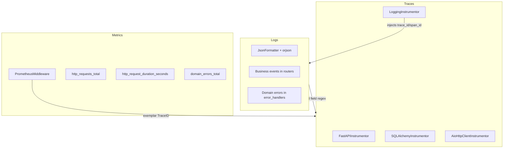
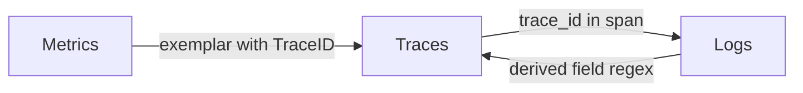
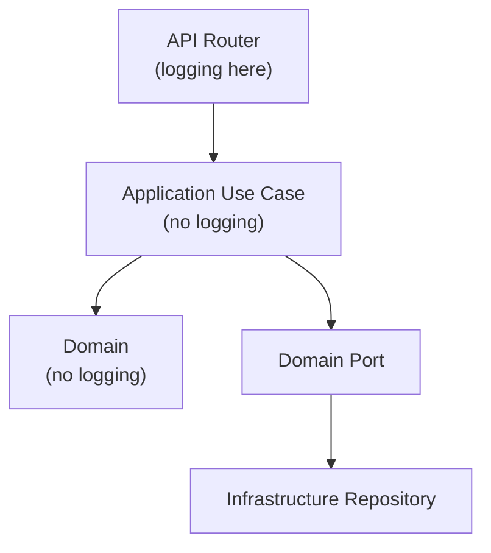

# Observability Design

uLabel implements the **three pillars of observability** — logs, traces, and metrics — with full correlation between them. This page explains the design decisions and how the pieces fit together.

## Stack Overview



| Component  | Role                        | Port  |
|------------|-----------------------------|-------|
| Prometheus | Scrapes and stores metrics  | 9090  |
| Tempo      | Receives and stores traces  | 3200  |
| Loki       | Collects and indexes logs   | 3100  |
| Grafana    | Unified visualization UI    | 3000  |

## Three Pillars



### Logging

Structured JSON logging via `JsonFormatter` using `orjson` for performance. Each log entry contains:

```json
{
  "timestamp": "2025-01-15T10:30:00+00:00",
  "level": "INFO",
  "logger": "ulabel.api.routers.images",
  "message": "Image uploaded: project=... image=... size_bytes=1024 content_type=image/png",
  "service": "ulabel-backend",
  "trace_id": "abc123...",
  "span_id": "def456..."
}
```

`trace_id` and `span_id` are injected automatically by OpenTelemetry's `LoggingInstrumentor` — no manual effort needed. Any `logger.info()` call anywhere in the application gets trace context for free.

**Configuration** is centralized in `config.yml`:

```yaml
observability:
  log_level: "${LOG_LEVEL:INFO}"
  log_format: "json"            # or "text" for local development
  service_name: "ulabel-backend"
```

### Tracing

OpenTelemetry distributed tracing with automatic instrumentation:

| Instrumentor              | What it captures                          |
|---------------------------|-------------------------------------------|
| `FastAPIInstrumentor`     | HTTP method, path, status, duration       |
| `SQLAlchemyInstrumentor`  | SQL queries, database operations          |
| `AioHttpClientInstrumentor` | Outbound HTTP calls                     |
| `LoggingInstrumentor`     | Injects trace/span IDs into log records   |

**Sampling** uses `ForceTraceSampler`:

- By default, traces are sampled at a configurable ratio (default 100%).
- Sending the header `X-Force-Trace: true` forces a request to be sampled regardless of the ratio. Useful for debugging specific requests in production.

Traces are exported via **OTLP gRPC** to Tempo using `BatchSpanProcessor` for efficient batching.

### Metrics

Prometheus metrics collected by `PrometheusMiddleware`:

| Metric                           | Type      | Labels                    |
|----------------------------------|-----------|---------------------------|
| `http_requests_total`            | Counter   | method, path, status      |
| `http_request_duration_seconds`  | Histogram | method, path              |
| `http_requests_in_progress`      | Gauge     | method, path              |
| `http_exceptions_total`          | Counter   | method, path, exception_type |
| `domain_errors_total`            | Counter   | code, status              |

Path labels use the **route template** (e.g., `/v1/projects/{project_id}/images`) instead of actual UUIDs to avoid cardinality explosion.

**Exemplars** link each metric observation to its trace. The middleware attaches `{TraceID: <hex>}` to every `observe()` and `inc()` call. Metrics are served in **OpenMetrics** format at `/metrics` to support exemplar exposition.

## Correlation Between Pillars



| From    | To     | Mechanism                                                        |
|---------|--------|------------------------------------------------------------------|
| Metrics | Traces | Exemplars: click a data point in Grafana to jump to its trace    |
| Logs    | Traces | Loki derived field extracts `trace_id` from JSON and links to Tempo |
| Traces  | Logs   | Tempo shows `service.name`, searchable in Loki by trace_id       |

This is configured in `etc/grafana/provisioning/datasources/datasources.yml`:

- Prometheus → Tempo: `exemplarTraceIdDestinations` maps `TraceID` label to Tempo
- Loki → Tempo: `derivedFields` with regex `"trace_id":"(\w+)"` links to Tempo

## Architectural Decision: Where to Log

Business event logging lives in the **API layer** (routers), not in use cases or domain:



**Why:** `logging` is I/O (infrastructure). The domain and application layers must remain pure and free of infrastructure dependencies, following hexagonal architecture principles. The API layer is already infrastructure and has full access to HTTP context (request parameters, file sizes, response data).

## Business Events Logged

| Router       | Event                     | Key fields                                  |
|--------------|---------------------------|---------------------------------------------|
| tokens       | `User logged in`          | id, username, role                          |
| projects     | `Project created`         | id, name, owner, label count                |
| projects     | `Project updated`         | id                                          |
| projects     | `Labeler added to project`| project, labeler                            |
| images       | `Image registered`        | project, image, storage key                 |
| images       | `Image uploaded`          | project, image, size_bytes, content_type    |
| images       | `Import started`          | job, project, prefix                        |
| images       | `Label submitted`         | project, image, labeler, label              |
| assignments  | `Assignment created`      | project, image, labeler                     |
| exports      | `Export generated`        | project, format                             |
| error_handlers | `Domain error`          | code, method, path                          |
