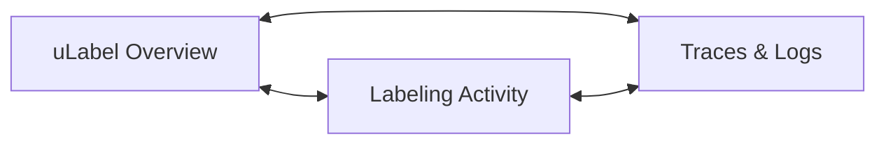

# Grafana Dashboards

How to access and use the uLabel monitoring dashboards.

## Accessing Grafana

With the local stack running (`docker compose up`):

- **URL:** [http://localhost:3000](http://localhost:3000)
- **User:** `admin`
- **Password:** `admin`

All dashboards are **auto-provisioned** from `etc/grafana/provisioning/dashboards/`. Changes made in the Grafana UI are not persisted — edit the JSON files instead.

## Dashboard Navigation

The three dashboards are linked via header links. Click the dashboard name in the top-left corner to switch between them.

## uLabel Overview

**Purpose:** Service health and HTTP performance at a glance.

**URL:** [/d/ulabel-overview](http://localhost:3000/d/ulabel-overview)

### Panels

| Panel                     | What it shows                                      |
|---------------------------|----------------------------------------------------|
| Request Rate (stat)       | Current requests/second across all endpoints       |
| Error Rate (stat)         | Percentage of 4xx+5xx responses                    |
| P99 Latency (stat)        | 99th percentile response time                      |
| In Progress (stat)        | Number of requests currently being processed       |
| Request Rate by Endpoint  | Time series of req/s broken down by method + path  |
| Error Rate by Endpoint    | Time series of errors by method, path, status code |
| Latency by Endpoint (P95) | Per-endpoint 95th percentile latency               |
| Latency Percentiles       | Global P50/P90/P99 over time                       |
| Domain Errors by Type     | Rate of domain errors by error code                |
| Requests In Progress      | Concurrent request count by endpoint               |
| Recent Logs               | Live log stream from Loki                          |

### Using Variables

Use the dropdown selectors at the top of the dashboard:

- **path** — Filter all panels by route (e.g., `/v1/projects/{project_id}/images/upload`). Select multiple or "All".
- **method** — Filter by HTTP method (GET, POST, PATCH). Select multiple or "All".

### Using Exemplars

Exemplars appear as **diamond markers** on the Request Rate, Error Rate, and Latency time series panels. Each diamond represents a specific request linked to its trace.

To investigate a slow or failed request:

1. Hover over a diamond on a latency panel
2. Click **"View in Tempo"** in the tooltip
3. Grafana opens the full trace in Tempo, showing the span waterfall

This is the primary mechanism for going from "I see a latency spike" to "here is exactly what happened".

## uLabel Labeling Activity

**Purpose:** Business-level metrics derived from structured log events.

**URL:** [/d/ulabel-labeling-activity](http://localhost:3000/d/ulabel-labeling-activity)

### Panels

| Panel                      | What it shows                                       |
|----------------------------|-----------------------------------------------------|
| Labels/min (stat)          | Current labeling throughput                         |
| Uploads/min (stat)         | Current image upload rate                           |
| Assignments/min (stat)     | Current assignment creation rate                    |
| Exports/min (stat)         | Current export generation rate                      |
| Labels Submitted Over Time | Labeling activity trend (bar chart)                 |
| Labels by Value            | Breakdown by label value, stacked                   |
| Image Uploads Over Time    | Uploads vs registrations over time                  |
| Upload Size Distribution   | Average and max image size in bytes                 |
| Assignments Created        | Assignment creation trend                           |
| Imports & Exports          | Import started/completed and export generated/cached|
| Logins Over Time           | User login frequency                                |
| Project Management Events  | Projects created/updated, labelers added            |
| Business Event Log         | Live stream of business events from routers         |

### Interpreting the Data

- **Labels/min dropping** while **Assignments/min stays steady** may indicate labelers are taking longer or encountering issues.
- **Upload Size Distribution** helps detect unusually large images that could slow processing.
- **Imports & Exports** panel distinguishes cached exports (no regeneration needed) from freshly generated ones.

## uLabel Traces & Logs

**Purpose:** Debugging and investigation of errors and performance issues.

**URL:** [/d/ulabel-traces-logs](http://localhost:3000/d/ulabel-traces-logs)

### Panels

| Panel                | What it shows                                       |
|----------------------|-----------------------------------------------------|
| Errors/min (stat)    | Rate of ERROR-level log entries                     |
| Warnings/min (stat)  | Rate of WARNING-level log entries                   |
| Domain Errors/min    | Rate of domain error log entries                    |
| Expired/min (stat)   | Rate of expired stale assignments                   |
| Recent Traces        | Trace list from Tempo (TraceQL search)              |
| Error & Warning Rate | ERROR vs WARNING counts over time                   |
| Log Volume by Logger | Log entries per Python logger module                |
| Error Logs           | Filtered log stream (ERROR + WARNING only)          |
| Full Log Stream      | Complete log stream with level/logger filters       |

### Using Variables

- **level** — Filter the Full Log Stream by log level (DEBUG, INFO, WARNING, ERROR). Select multiple.
- **logger** — Filter by Python logger module (e.g., `ulabel.api.routers.images`).

### Investigating an Error

1. Check the **Errors/min** stat — is the error rate elevated?
2. Open the **Error Logs** panel to see recent ERROR/WARNING messages
3. Find the relevant log entry and expand its details to see `trace_id`
4. Click the `trace_id` link — Grafana opens the trace in Tempo
5. In Tempo, inspect the span waterfall to see which operation failed and how long each step took

### Navigating from Log to Trace

Loki is configured with a **derived field** that extracts `trace_id` from JSON log entries. When you expand a log entry in any log panel, the `trace_id` field appears as a clickable link to Tempo.
